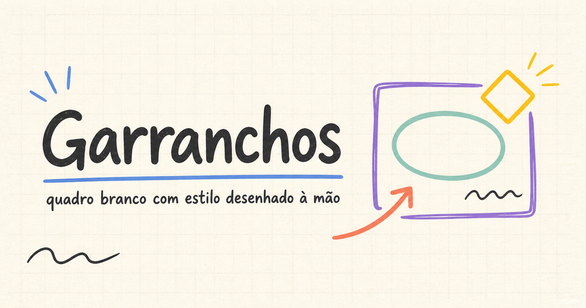

# Garranchos

## Quadro branco com estilo desenhado à mão



**Demo ao vivo:** [garranchos.vercel.app](https://garranchos.vercel.app/)

Garranchos é um whiteboard online inspirado no Excalidraw, criado como projeto de portfólio e aprendizado. Ele combina Canvas API, formas com aparência de rascunho e ferramentas para desenhar, diagramar e organizar ideias — gratuitamente e sem login.

## O que já funciona

### Desenho e edição

- Selecionar, mão/pan, retângulo, diamante, elipse, linha, seta, texto, lápis (freehand) e borracha.
- Formas geométricas renderizadas com `rough.js`; traços livres suavizados com `perfect-freehand`.
- Seleção única, seleção múltipla por marquee nos modos **Overlap** e **Wrap**, e `Shift`+clique.
- Mover elementos individualmente ou em conjunto.
- Guias inteligentes de alinhamento durante o movimento, com encaixe por bordas e centros.
- Agrupar/desagrupar elementos com `Ctrl/Cmd+G` e `Ctrl/Cmd+Shift+G`.
- Resize por handles: cantos para formas, imagens, freehand e texto; pontas para linhas e setas.
- Rotação por handle para elementos selecionados individualmente, com `Shift` para incrementos de 15°.
- Texto de uma linha na criação, com suporte a conteúdo multilinha importado ou editado.

### Estilo e organização

- Cor e espessura do contorno.
- Preenchimento para formas fechadas.
- Traço sólido, tracejado ou pontilhado.
- Precisão do traço (`roughness`), opacidade e cantos retos/arredondados para retângulos.
- Painel de propriedades lateral no desktop e bottom sheet em telas estreitas.
- Camadas: trazer para frente, mandar para trás, avançar e recuar uma camada.
- Undo/redo por snapshots, com atalho de teclado e limite de histórico por sessão.
- Grade visual configurável e encaixe opcional em uma malha fixa de 20 unidades.
- Zoom pelo teclado (`Ctrl/Cmd +`, `Ctrl/Cmd -` e `Ctrl/Cmd+0`).

### Arquivos, clipboard e persistência

- Duplicar e copiar/colar elementos usando um clipboard interno da aplicação.
- Inserir imagens por upload, colagem da área de transferência do sistema e arrastar/soltar arquivo.
- Salvamento automático local no navegador.
- Múltiplos quadros nomeados, com criação, troca, renomeação, duplicação e exclusão.
- Exportação para PNG, SVG e JSON.
- Importação de JSON próprio e de arquivos `.excalidraw` reais.
- Link compartilhável sem backend: a cena é compactada no fragmento da URL e aberta em modo somente leitura.

### Modos e interface

- Tema claro, escuro e sistema, separado da cor de fundo do desenho.
- Modo Zen, modo de visualização e modo apresentação em tela cheia.
- Laser pointer temporário no modo apresentação.
- Toolbar flutuante responsiva, menu hambúrguer com seções/submenus e menu de contexto.
- Diálogos próprios de confirmação e painel de atalhos.
- Efeito de partículas ao apagar e animação curta ao criar elementos.
- Pointer Events para mouse, toque e caneta; gesto de dois dedos para pan/zoom e reposicionamento do campo de texto quando o teclado virtual aparece.

## Stack

Versões conforme `package.json` e `package-lock.json`:

- Next.js `15.5.23` com App Router
- React `19.1.0` e TypeScript `5.7.2`
- Canvas API nativa para renderização
- `roughjs` `4.6.6` para formas sketch
- `perfect-freehand` `1.2.2` para lápis/freehand
- Zustand `5.0.15` para estado do editor
- Tailwind CSS `3.4.17` para a interface
- `lucide-react` `1.34.0` para ícones
- `lz-string` `1.5.0` para compactação de links compartilháveis
- Vitest `2.1.8` para testes unitários

## Rodando localmente

```bash
git clone https://github.com/LuisT-ls/excalidraw.git
cd excalidraw
npm install
npm run dev
```

Abra [http://localhost:3000](http://localhost:3000). Os demais scripts disponíveis são:

```bash
npm test          # testes unitários com Vitest
npm run build     # build de produção
npm start         # inicia o build de produção
```

## Organização do código

```text
src/
├── app/                         # layout, página e metadados do Next.js
├── components/
│   ├── theme/                   # tema da interface
│   ├── ui/                      # diálogo, menu e componentes compartilhados
│   └── whiteboard/              # Canvas, toolbar, menu e painéis
└── features/editor/
    ├── interaction/             # criação, hit-testing, seleção, resize e rotação
    ├── model/                   # tipos, geometria, estilos e clones
    ├── persistence/             # storage, importação e exportações
    ├── rendering/               # Canvas, SVG, rough.js e métricas de texto
    └── store/                   # stores Zustand do editor e preferências
```

## Limitações e próximos passos

- Não há colaboração em tempo real, backend, contas ou sincronização entre dispositivos/abas.
- A ferramenta de texto confirma com `Enter`; criar novas quebras de linha durante a digitação ainda é uma evolução futura.
- Imagens são embutidas como dados na cena para simplificar a persistência local; o código limita cada arquivo a 10 MB e ajusta seu maior lado para até 300 unidades de mundo.
- O código inclui Pointer Events, pinch/pan e suporte ao teclado virtual, mas a validação manual em dispositivos físicos depende do ambiente de teste.

## Autor

[Luís Teixeira](https://github.com/LuisT-ls)

Repositório: [github.com/LuisT-ls/excalidraw](https://github.com/LuisT-ls/excalidraw)

## Licença

Este projeto está sob a [licença MIT](LICENSE).
